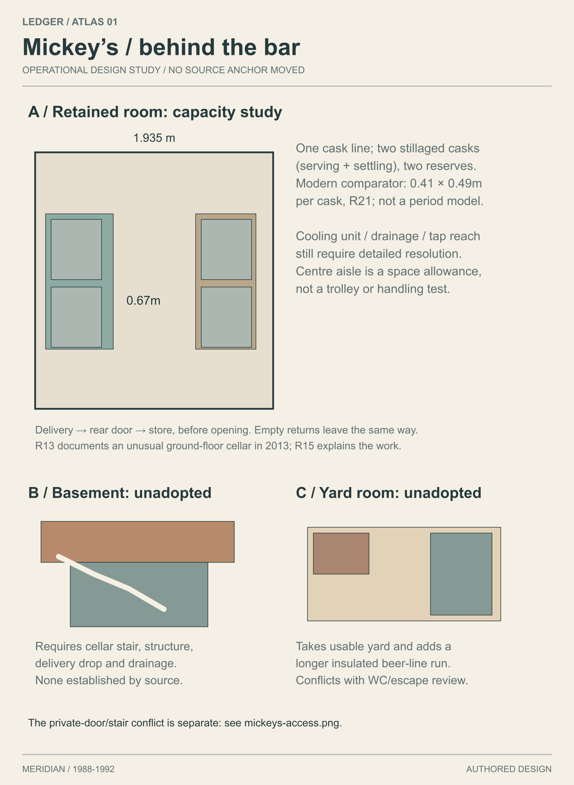

# Atlas 01: Meridian and Mickey's

OWNER VISUAL APPROVAL PENDING. Base commit: **7722b45cb3dcee2fbcee26675fae4fef641cbba7**, explicitly pinned by the owner in Codex desktop. Branch: **art/atlas-01**, created from that exact commit in an isolated clone after inspecting the available checkout and worktrees. No prior conversation SHA or main state was used.

## Continuation of reviewed delivery b81667e

The reviewed delivery **b81667e203415ff7b0f34622c3dcd1cc96139801** is preserved. [Recipe repair](RECIPE-REPAIR.md) removes the hardcoded plan/model split; [access comparison](previews/mickeys-access.png) exposes the private-door conflict without moving its source anchor. The repair was published at **40811f56825ac0737b818689f5e138396d7218a2**, with request metadata at **1e625318f6cfba8e7f939e9ec1a35210c3f53a60**. Studio interface, art convention, opt-in lanes, BOM and assets were read at **e5b33d1317e20d672e4f9e39c09e4db41d023e0f** without replacing the owner pin; [reconciliation](RECONCILIATION.md) records the reads. No new REVIEW or equivalent atlas result was found at the inspected revisions.

The [research continuation](references/CONTINUATION.md) inspects ordinary 1989 photographs, period pub/retail pages and a hilly-port comparison. It changes the design through [shop, housing and service studies](previews/evidence-revisions.png), [work/home routes](previews/town-work-and-home.png), [twelve Hook frontage uses](previews/hook-uses.png) and the pub service comparison above. Modern commercial refits, working cargo and occupied flats qualify the heritage-heavy first direction. Unsupported blanket bans on wheeled bins, tactile paving and contemporary pub refits are withdrawn. Dates, source locators, rights, interpretation and fictional choices are separate. The original concepts remain proposals, not canon.

The [production catalogue](PRODUCTION-CATALOGUE.md) retains all 77 BOM and 21 proposed IDs with separate availability, suitability and integration fields. Eight actual GLBs and three existing generated PNGs were inspected. The 400mm grate and plain frame are reuse candidates; a 100mm drain is not a street manhole, and the decorative lamp is not the selected utilitarian Hook column. Existing fascia artwork is legible but cannot be stretched onto a 6×0.55m plate. Authored lettering resolves the composition without another lettering-generation run.

The [first batch](data/first-batch.json) specifies **12 work packages / 16 initial placements**: grate, frame, fascia body/lettering, counter, till, hand-pull, two tables, screen, net, two bins and three notice graphics. Every package has an individual target or actual geometry picture, dimensions, placement, acquisition steps, interface constraints, collision/gameplay needs, variants, dependencies and explicitly estimated effort. [Artwork briefs](ARTWORK-BRIEFS.md) include four editable SVG layout proofs and one input for the existing local imagegen lane. Detailed WC/access, full beer equipment and upstairs possessions remain later work, not a falsely completed interior inventory.

### Current verification

- **69** source/arithmetic/SVG checks passed; **12** recipe mutation checks passed; **15** focused catalogue/input checks passed. Python syntax and JSON agreement are not Blender execution.
- The actual studio imagegen `validate_spec` accepted the one-item pilot brief with **zero problems**, without downloading a model or generating an image.
- Existing Sharp rasterised the SVGs. Maps, access/service studies, eight mesh projections, ten object targets and four text proofs were opened. Road/massing overlap, diagram collisions and Windows punctuation decoding were corrected after inspection.
- Full repository verification remains unavailable: the earlier attempt stopped at verify.py:165 because its `python3` subprocess could not start. It was not rerun unchanged. No C#, Blender, Unreal or Actions run is claimed.
- New GPU attempts/time: **0 / 0 seconds**. Accepted finished 3D assets: **0**. Accepted new generated production images: **0**. Four vector layout proofs delivered. Human review time was not timed; no throughput is inferred from 98 audit rows or checks.

[pilot-request.json](pilot-request.json) is pending, not dispatched. Research/catalogue/pilot source is **359236548953e8e0b68fabf9303685bec8d464e2**; the request records exact Git-blob hashes. It reuses the existing lane and does not duplicate/reseed `fascia_mickeys`. Claude must reconcile the one proposed record with the lane's real prompt path; the script has `--only`, but no invented arbitrary prompt-file flag. The five-camera render request remains separately pinned to repair source 40811f5. No shared-PC work was launched.

Research gaps remain explicit: calibrated D13 street-width distributions, period small-pub equipment/plan evidence, WC and threshold/stair poses, household contents, adult wardrobe, transport timetables and detailed distant interiors. The Grimsby archive film was not watched. Modern operational guidance is labelled as a later comparator, not 1990 proof. No building-code compliance is asserted.

## Visual index and inventory

| Package | Open the work | Provenance |
|---|---|---|
| Continuation research and design | [Evidence ledger](references/CONTINUATION.md), [visual changes](previews/evidence-revisions.png), [routes](previews/town-work-and-home.png), [Hook uses](previews/hook-uses.png) | Original drawn interpretations alongside linked dated evidence; no new concept generation |
| Production and artwork | [Catalogue](PRODUCTION-CATALOGUE.md), [batch data](data/first-batch.json), [artwork briefs](ARTWORK-BRIEFS.md), [fascia](previews/fascia_mickeys-layout-proof.png), [hours](previews/mickeys-hours-proof.png), [returns](previews/mickeys-returns-proof.png), [beer clip](previews/mickeys-pump-clip-proof.png) | Actual mesh projections distinguished from authored targets and vector layout proofs |
| A. Town form bible | [Research and rules](TOWN-FORM-BIBLE.md), [Hull board](previews/reference-hull.png), [Kasbah board](previews/reference-kasbah.png) | Dated photograph, historic map and modern heritage evidence; [rights](references/RIGHTS.md). Original analysis, no traced layout |
| B. Authored atlas | [Overview SVG](previews/atlas-overview.svg), [town gameplay overlay](previews/gameplay-overlay.png), [Hook source street](previews/hook-detail.png) | Explicit authored data in [atlas.json](data/atlas.json), regenerated by [draw.py](scripts/draw.py). Routes, contours and landmarks are proposals |
| C. Seven districts | [District visual index](DISTRICTS.md) | Seven actual AI concept sheets, each with establishing and street-height views, materials and characteristic objects; seven matching drawn map/palette sheets |
| D. Mickey's | [Design and history](MICKEYS.md), [ground](previews/mickeys-ground.png), [upper](previews/mickeys-upper.png), [elevations](previews/mickeys-elevations.png), [yard](previews/mickeys-yard.png), [partial knowledge](previews/mickeys-gameplay.png) | Explicit dimensions in [mickeys.json](data/mickeys.json); [Blender source](recipes/mickeys_blockout.py) is an unrendered spatial blockout |
| E. Design-derived assets | [Illustrated searchable audit](assets.html), [machine-readable audit](data/assets.json) | All 77 source BOM entries plus 21 proposed IDs. Unique assemblies, families, variants, placements and state requirements are separate. Engine verification is a separate field |

The asset HTML opens locally after downloading the branch; GitHub displays its source. The Markdown visual index and all PNGs can be viewed directly on GitHub. [INVENTORY.md](INVENTORY.md) lists every commission file and its hash. [PROVENANCE.md](PROVENANCE.md) records image and source origins. Scripts are confined to this directory.

## Original delivery evidence retained

- Python 3.12.8 generated 17 SVG boards/maps/plans from authored data and retained reference images. Existing bundled Node/Sharp rendered their PNG previews. No new toolchain was installed.
- The commission's [check.py](scripts/check.py) passed all 42 invariants recorded in [verification.json](verification.json): source anchors, seven districts, named information venues, road/massing separation, pub furniture clearances, source door widths, stair arithmetic, SVG structure and BOM links. These are source/2D checks, not game tests.
- A separate headless Edge 152.0.4191.66 instance with an isolated temporary profile opened the asset HTML at 390 x 844. Filtering to A01_PUB_BAR showed one row and no horizontal overflow. Its own browser instance was closed. Existing browser sessions and PC jobs were untouched.
- The actual four source day/night street frames and five walk frames were viewed, including the full facade day image, before making asset judgments. They show massing and some street detail; they do not establish finished materials or this proposed interior.
- All generated district concepts, maps, pub plans and reference boards were opened visually. Corrections included roof direction, front-door left/right orientation, neighbour order, a blocked escape line, rear-lane alignment, label collisions and period/skyline inventions in AI images. Final drawings control dimensions; AI perspective and incidental lettering are not construction documents.
- `python ledger/verify.py` was attempted once. It exited 1 before its first lint could run because the script invokes `python3`, unavailable to that Windows subprocess (`WinError 2` at verify.py:165). No green verification footer was created or claimed. No C# test, Unreal execution or Actions run is claimed for this commission.

The broad atlas is an authored morphology/massing proposal, not a finished door-by-door town inventory or heightfield. Every future interior must be deliberately authored under the owner's D14 ruling; no procedural Tier 2 room grammar is used here. D13's statistical comparison and player-height acceptance gate remain unverified. Routes, witness lines, meetings, escape opportunities and sound carry are design intentions, not tested simulation outcomes. The Old Basin detour requires the proposed swing bridge to be closed to boats.

## Pending render and interface dependencies

No Blender execution or shared-PC dispatch was attempted. The studio now has an opt-in lane and static-prop interface, read at e5b33d1317e20d672e4f9e39c09e4db41d023e0f. The lane needs the adapter and exact-source reconciliation described in INTERFACE-NOTES.md. The existing [render-request.json](render-request.json) is pinned to repair source **40811f56825ac0737b818689f5e138396d7218a2**; this is a request, not a submission.

The recipe requests five previews: street approach, front, rear, overhead cutaway and player-height interior. Success requires visible agreement with the plans, continuous routes and correct source placement, plus a Blender-version/input-hash receipt. A .blend file, object count or successful exit alone is insufficient. No Blender preview or engine-ready export is included.

[INTERFACE-NOTES.md](INTERFACE-NOTES.md) isolates provisional units, axes, pivots, material slots and proposed gameplay markers. Reconcile the studio interface before FBX/glTF/engine exports, collision, portal or interaction bindings. New assets are proposals; research images are not cleared runtime textures.

## Integration notes

Consume only production/art/atlas-01 from this branch. The existing art consumer files once per commission, so update an existing integration task to these revisions rather than duplicating it. Keep Mickey's at east_parade_bay0; replace its solid proxy deliberately, retaining IDs and anchors. Schedule the existing five-camera repair request, then the small pilot through the published lanes after input reconciliation. Validate axes, doors/stairs, navigation, surface binding, acoustics, perception and scheduled contacts independently. No canon, live scene/code, workflow, dispatch control, next-three, material generator or studio-v2 file was edited. No PC work, PR, merge or Telegram message was launched; no Claude receipt or integration is asserted.

## Concrete visual choices for approval

1. Adopt the metal-fronted Quay Stores and occupied lower-Fairview flats alongside the retained older fabric.
2. Keep or revise the oxblood/gold fascia's visual weight using its dimension-correct lettering proof.
3. Retain the conditional ground-store direction while the private-door/stair conflict and WC are resolved; the cellar/yard sketches are unadopted alternatives.
4. Approve or revise the fictional CLAYBANK BITTER clip and simple paper-notice style before production.

The source pin is resolved. Remaining dependencies are visual approval, reconciliation with the narrow static-prop interface, a scheduled Blender preview, and live-game verification.
