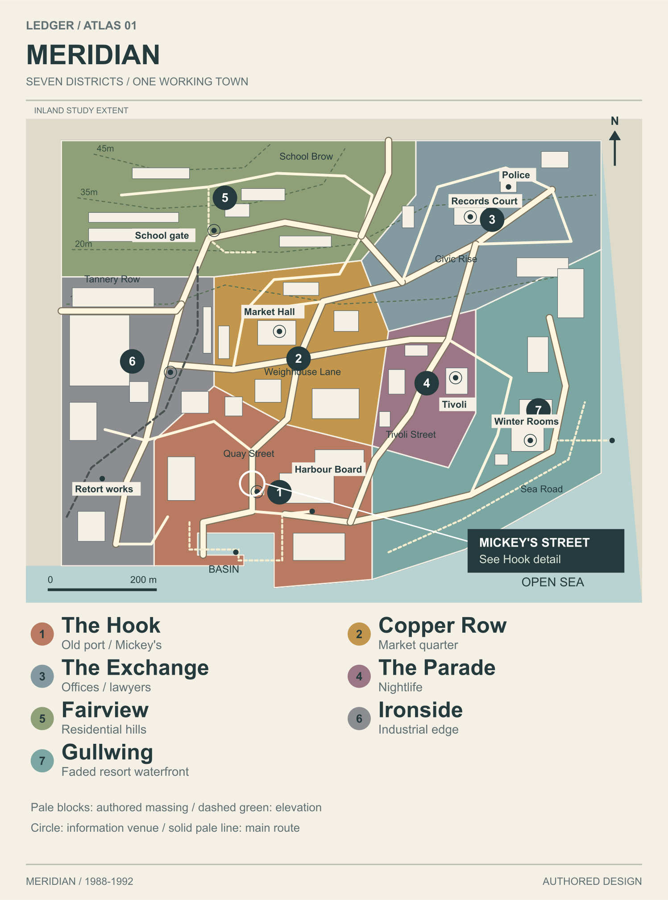
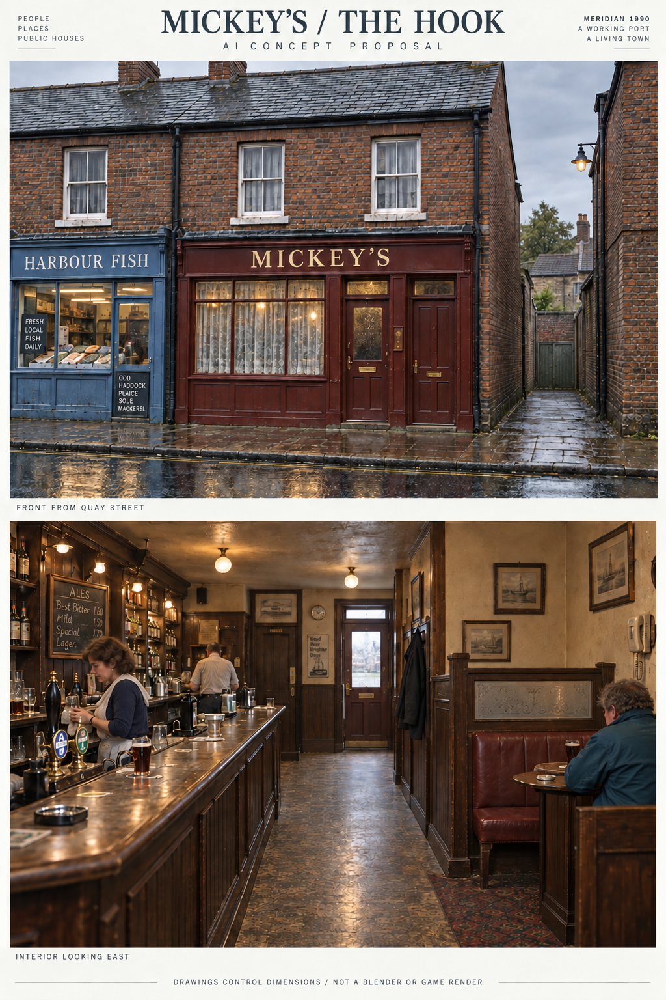

# Atlas 01: Meridian and Mickey's

OWNER VISUAL APPROVAL PENDING. Base commit: **7722b45cb3dcee2fbcee26675fae4fef641cbba7**, explicitly pinned by the owner in Codex desktop. Branch: **art/atlas-01**, created from that exact commit in an isolated clone after inspecting the available checkout and worktrees. No prior conversation SHA or main state was used.

## Recipe repair continuation

The reviewed delivery is preserved. [Recipe repair](RECIPE-REPAIR.md) removes the hardcoded plan/model split; [access comparison](previews/mickeys-access.png) exposes the private-door conflict without moving its source anchor. Twelve focused mutation checks passed in addition to the original invariants. The studio interface and opt-in lane now exist and were read at e5b33d1317e20d672e4f9e39c09e4db41d023e0f; [reconciliation](RECONCILIATION.md) records the revisions and the required lane adapter. Research and production-catalogue continuation is in progress.

## Visual index and inventory

| Package | Open the work | Provenance |
|---|---|---|
| A. Town form bible | [Research and rules](TOWN-FORM-BIBLE.md), [Hull board](previews/reference-hull.png), [Kasbah board](previews/reference-kasbah.png) | Dated photograph, historic map and modern heritage evidence; [rights](references/RIGHTS.md). Original analysis, no traced layout |
| B. Authored atlas | [Overview SVG](previews/atlas-overview.svg), [town gameplay overlay](previews/gameplay-overlay.png), [Hook source street](previews/hook-detail.png) | Explicit authored data in [atlas.json](data/atlas.json), regenerated by [draw.py](scripts/draw.py). Routes, contours and landmarks are proposals |
| C. Seven districts | [District visual index](DISTRICTS.md) | Seven actual AI concept sheets, each with establishing and street-height views, materials and characteristic objects; seven matching drawn map/palette sheets |
| D. Mickey's | [Design and history](MICKEYS.md), [ground](previews/mickeys-ground.png), [upper](previews/mickeys-upper.png), [elevations](previews/mickeys-elevations.png), [yard](previews/mickeys-yard.png), [partial knowledge](previews/mickeys-gameplay.png) | Explicit dimensions in [mickeys.json](data/mickeys.json); [Blender source](recipes/mickeys_blockout.py) is an unrendered spatial blockout |
| E. Design-derived assets | [Illustrated searchable audit](assets.html), [machine-readable audit](data/assets.json) | All 77 source BOM entries plus 21 proposed IDs. Unique assemblies, families, variants, placements and state requirements are separate. Engine verification is a separate field |

The asset HTML opens locally after downloading the branch; GitHub displays its source. The Markdown visual index and all PNGs can be viewed directly on GitHub. [INVENTORY.md](INVENTORY.md) lists every commission file and its hash. [PROVENANCE.md](PROVENANCE.md) records image and source origins. Scripts are confined to this directory.

## What ran and what was inspected

- Python 3.12.8 generated 17 SVG boards/maps/plans from authored data and retained reference images. Existing bundled Node/Sharp rendered their PNG previews. No new toolchain was installed.
- The commission's [check.py](scripts/check.py) passed all 42 invariants recorded in [verification.json](verification.json): source anchors, seven districts, named information venues, road/massing separation, pub furniture clearances, source door widths, stair arithmetic, SVG structure and BOM links. These are source/2D checks, not game tests.
- A separate headless Edge 152.0.4191.66 instance with an isolated temporary profile opened the asset HTML at 390 x 844. Filtering to A01_PUB_BAR showed one row and no horizontal overflow. Its own browser instance was closed. Existing browser sessions and PC jobs were untouched.
- The actual four source day/night street frames and five walk frames were viewed, including the full facade day image, before making asset judgments. They show massing and some street detail; they do not establish finished materials or this proposed interior.
- All generated district concepts, maps, pub plans and reference boards were opened visually. Corrections included roof direction, front-door left/right orientation, neighbour order, a blocked escape line, rear-lane alignment, label collisions and period/skyline inventions in AI images. Final drawings control dimensions; AI perspective and incidental lettering are not construction documents.
- `python ledger/verify.py` was attempted once. It exited 1 before its first lint could run because the script invokes `python3`, unavailable to that Windows subprocess (`WinError 2` at verify.py:165). No green verification footer was created or claimed. No C# test, Unreal execution or Actions run is claimed for this commission.

The broad atlas is an authored morphology/massing proposal, not a finished door-by-door town inventory or heightfield. Every future interior must be deliberately authored under the owner's D14 ruling; no procedural Tier 2 room grammar is used here. D13's statistical comparison and player-height acceptance gate remain unverified. Routes, witness lines, meetings, escape opportunities and sound carry are design intentions, not tested simulation outcomes. The Old Basin detour requires the proposed swing bridge to be closed to boats.

## Pending render and interface dependencies

No Blender execution or shared-PC dispatch was attempted. The studio now has an opt-in lane and static-prop interface, read at e5b33d1317e20d672e4f9e39c09e4db41d023e0f. The lane needs the adapter and exact-source reconciliation described in INTERFACE-NOTES.md. The existing [render-request.json](render-request.json) is pinned to repair source **40811f56825ac0737b818689f5e138396d7218a2**; this is a request, not a submission.

The recipe requests five previews: street approach, front, rear, overhead cutaway and player-height interior. Success requires visible agreement with the plans, continuous routes and correct source placement, plus a Blender-version/input-hash receipt. A .blend file, object count or successful exit alone is insufficient. No Blender preview or engine-ready export is included.

[INTERFACE-NOTES.md](INTERFACE-NOTES.md) isolates provisional units, axes, pivots, material slots and proposed gameplay markers. Reconcile the studio interface before FBX/glTF/engine exports, collision, portal or interaction bindings. New assets are proposals; research images are not cleared runtime textures.

## Integration notes

Consume only production/art/atlas-01 from this branch. Keep Mickey's at east_parade_bay0 on the existing Hook street; replace the solid proxy deliberately when integrating its hollow interior, retaining source IDs and anchors. Reconcile axes, aperture dimensions, private/public doors, the south return passage, navigation, acoustic/perception behaviour and scheduled contacts with the live game. No canon, live scene, gameplay code, workflow, dispatch control, next-three file, material generator or studio-v2 file was edited. The art branch does not establish a competing studio process. Claude's map work was neither copied nor modified, and no integration or Telegram receipt is asserted.

## Concrete visual choices for approval

1. The compact working basin and inland Fairview rise, with separate industrial, civic, nightlife and resort waterfront identities.
2. Mickey's oxblood chandler-derived frontage, two adjacent source doors, modest net curtains and its position as the first east-side bay.
3. The small counter-and-snug interior, compact private stair with an outward-opening household door, yard WC and overlooked rear escape route. The private door's footway sweep needs particular review.
4. The seven district palettes and landmark silhouettes shown in the concepts, before detailed asset production.

The source pin is resolved. Remaining dependencies are visual approval, reconciliation with the narrow static-prop interface, a scheduled Blender preview, and live-game verification.
