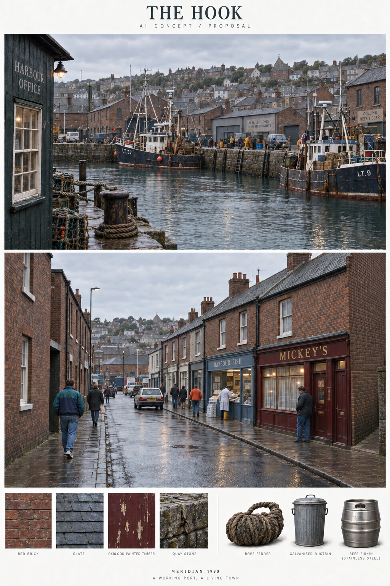
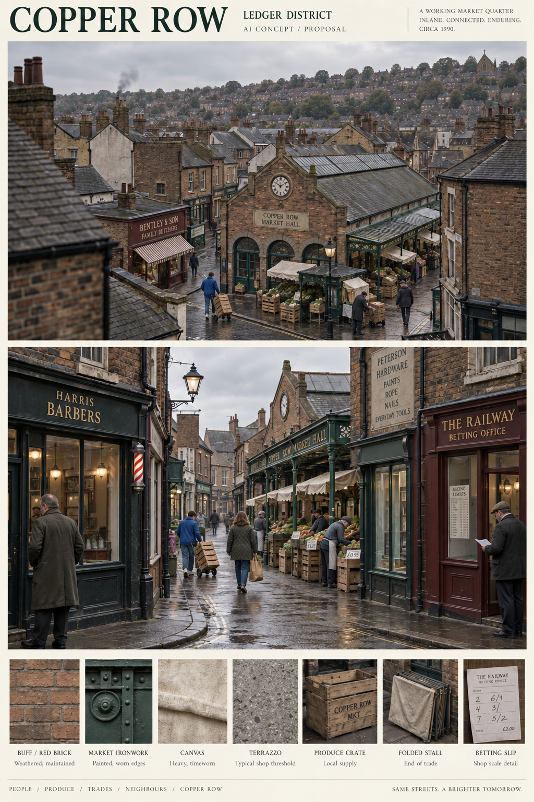
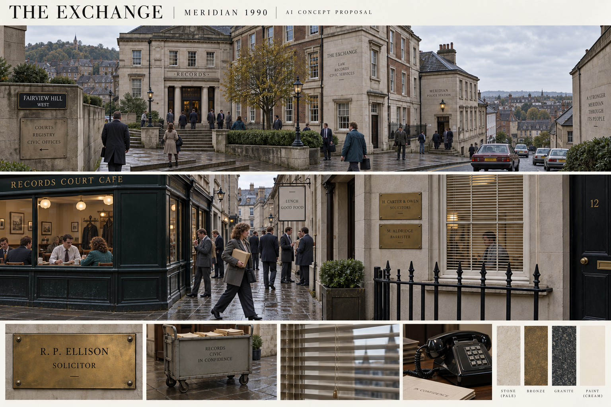
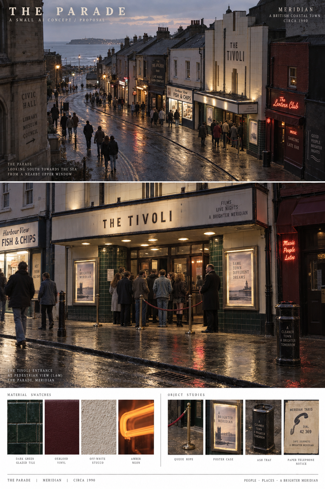
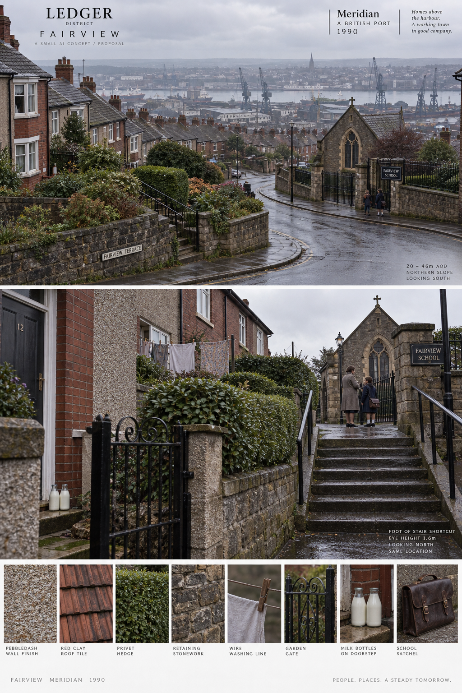
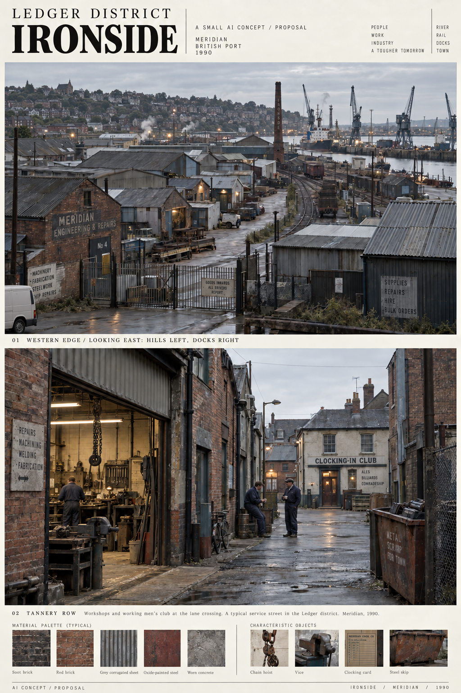
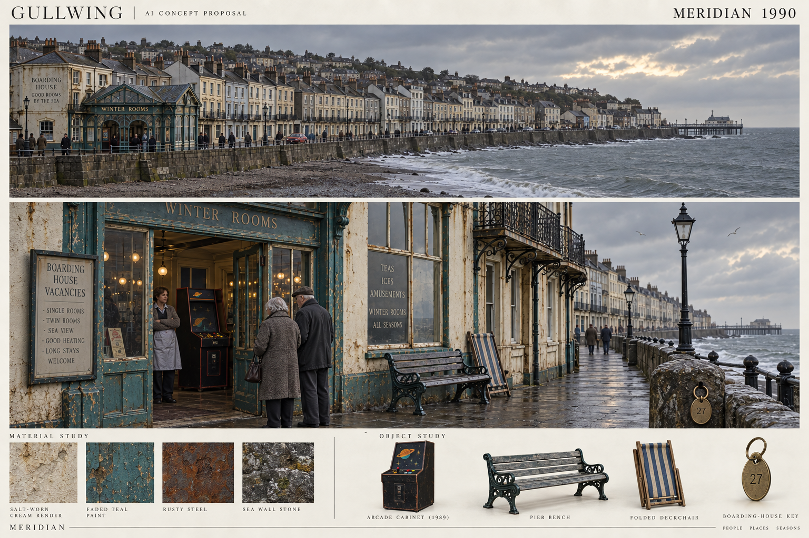

# Seven district proposals

Every sheet contains an establishing image, a player-height image, materials and characteristic objects. These are AI concept proposals, not reference photographs or rendered geometry. The companion map sheets share the atlas coordinates. Numerical dimensions and placement remain in the drawn/data sources; incidental AI detail is not an asset specification.

## The Hook

Low working quays and deep shop plots. Mickey's is the first east-side bay on Quay Street; the fish shop follows north. The basin is south, market uphill north. Delivery and evening regulars make repeated contact plausible.

[Map and palette](previews/district-hook-plan.png) | [Regenerable SVG](previews/district-hook-plan.svg)

## Copper Row

The market hall sits beside Weighhouse Lane, between the Hook and Fairview. Folded stalls preserve access after trading; barbers and betting offices supply different reasons to linger. Conversations here should mix people from other districts.

[Map and palette](previews/district-copper-plan.png) | [Regenerable SVG](previews/district-copper-plan.svg)

## The Exchange

Records Court cafe faces formal offices on the northeast inland shelf. Police and legal offices are separate named destinations. Glazing and venetian blinds make observation asymmetric; a queue at the counter can reveal a visit without revealing its purpose.

[Map and palette](previews/district-exchange-plan.png) | [Regenerable SVG](previews/district-exchange-plan.svg)

## The Parade

The Tivoli marks a nightlife route between the coast and the civic quarter. Tile, small neon and poster cases distinguish the evening street from the Hook. Queues and taxi telephone notices make slow, visible transitions between venues.

[Map and palette](previews/district-parade-plan.png) | [Regenerable SVG](previews/district-parade-plan.svg)

## Fairview

Contour-following residential terraces rise inland to the north and west. The school chapel and steps are the named landmark. Garden gates, retaining walls and upper windows divide access from observation; school meetings are design intentions.

[Map and palette](previews/district-fairview-plan.png) | [Regenerable SVG](previews/district-fairview-plan.svg)

## Ironside

Workshops and loading yards occupy the western industrial edge. The establishing view looks east, with hills left/north and docks right/south. The Retort works stack and Clocking-in club tie shift routines to Tannery Row. Gates have work destinations.

[Map and palette](previews/district-ironside-plan.png) | [Regenerable SVG](previews/district-ironside-plan.svg)

## Gullwing

A low sea-wall shelf on the eastern waterfront carries boarding houses, Winter Rooms arcade and a short pier. Rising inland roofs continue toward Fairview. Faded teal and salt render belong to leisure businesses still operating, not a universal ruin set.

[Map and palette](previews/district-gullwing-plan.png) | [Regenerable SVG](previews/district-gullwing-plan.svg)
